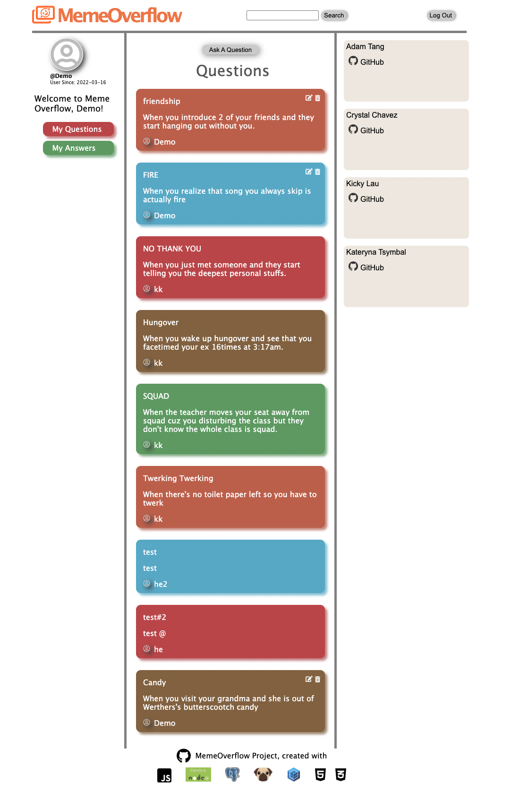
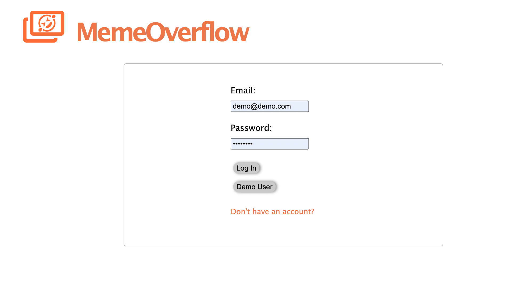
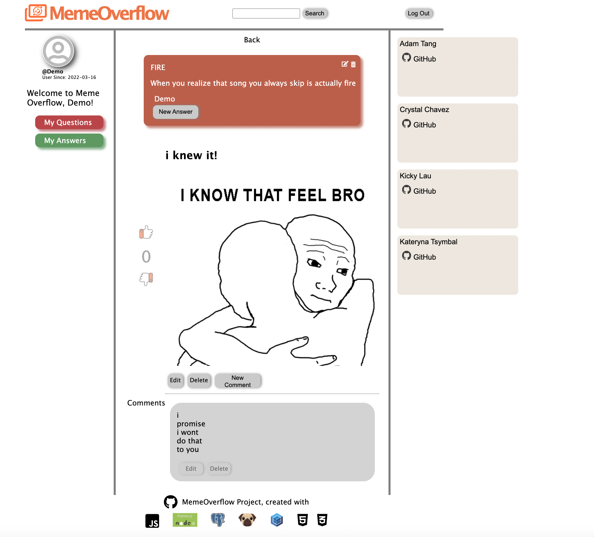
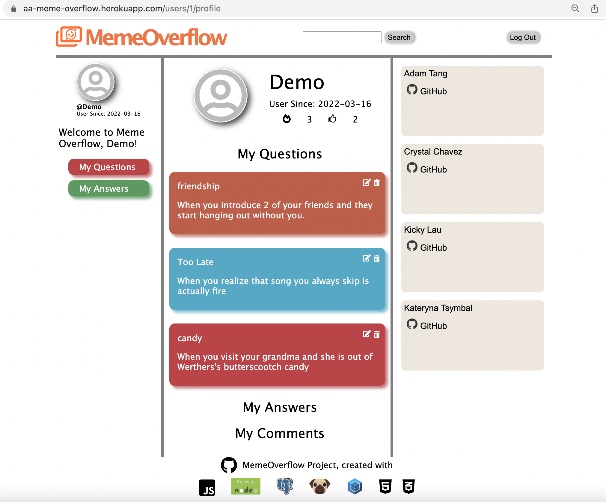
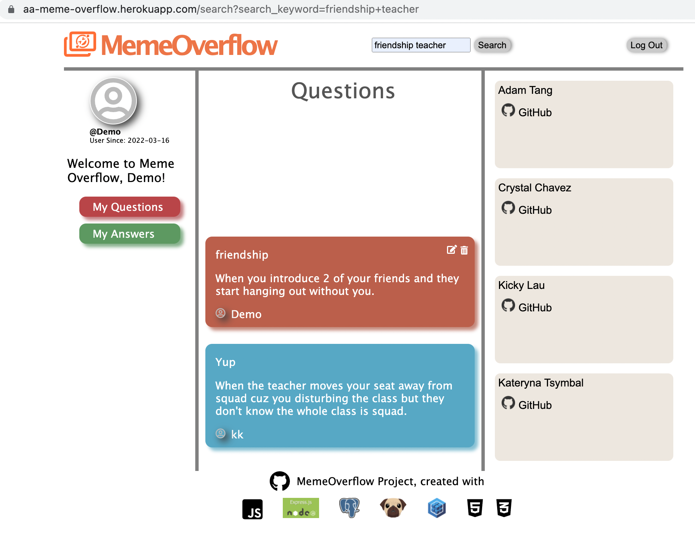

<!-- PROJECT LOGO -->
 

  <!-- <a href="https://aa-meme-overflow.herokuapp.com"> -->
    
  </a>

<h3 align="center">Meme-Overflow</h3>

  

    A portfolio clone of StackOverflow
     
    <a href="https://aa-meme-overflow.herokuapp.com/"><strong>Explore the docs »</strong></a>
     
  

<!-- TABLE OF CONTENTS -->

  
Table of Contents

  <ol>
    <li>
      <a href="#about-the-project">About The Project</a>
      <ul>
        <li><a href="#key-features">Key Features</a></li>
      </ul>
    </li>
    <li><a href="#build-with">Built With</a></li>
    <li><a href="#usage">Usage</a></li>
    <li><a href="#contact">Contact</a></li>
  </ol>

<!-- ABOUT THE PROJECT -->
## About The Project

Meme Overflow is a clone of StackOverflow, a website for users to ask questions, answer with memes, and comment on memes!

 

**Key Features**
* Create new users and have user login with authorization
* Post, edit, and delete meme questions/answers/comments that login users own
* User profile page with all meme questions/answers/comments created
* Upvote, downvote any meme answer login users like
* Search for meme question based on one or more keywords

(<a href="#top">back to top</a>)

<!-- BUILT WITH -->
## Built With

* [Javascript](https://www.javascript.com)
* [Express](http://expressjs.com)
* [PostgreSQL](https://www.postgresql.org/docs/)
* [Heroku](https://www.heroku.com)
* [BCrypt](https://www.npmjs.com/package/bcrypt)
* [CSS](https://developer.mozilla.org/en-US/docs/Web/CSS)
* [HTML5](https://developer.mozilla.org/en-US/docs/Glossary/HTML5)
* [Sequelize](https://sequelize.org/v5/manual/)
* [Pug](https://pugjs.org/api/getting-started.html)

(<a href="#top">back to top</a>)

<!-- USAGE EXAMPLES -->
## Usage

* Users can signup and login to use Meme Overflow, and can login as a demo user to experience the website quickly.

 

* Once logged in, the user is directed to the main question page, where logged-in users can view a list of questions based on time created, as well as their user profile page on left column, and a search bar on the top.

 

* Logged in users can create a new question/comment/answer. For questions/comments/answers a user owns, they can also be edited and deleted. Users can also upvote and downvote an answer.

 

* Users can click into user's profile page to view their information.

* Login users can also search questions by one or multiple keywords based on question title and content.

(<a href="#top">back to top</a>)

<!-- CONTACT -->
## Contact

Adam Tang - [GitHub](https://github.com/adamtang5)

Crystal Chavez - [GitHub](https://github.com/crystalchavez99)

Kateryna Tsymbal - [GitHub](https://github.com/TKat72)

Kicky Liu - [GitHub](https://github.com/kickylau)

Project Repo Link: [https://github.com/adamtang5/aa_mod4_meme_overflow_project](https://github.com/adamtang5/aa_mod4_meme_overflow_project)

Project Link: [https://aa-meme-overflow.herokuapp.com/](https://aa-meme-overflow.herokuapp.com/)

(<a href="#top">back to top</a>)

